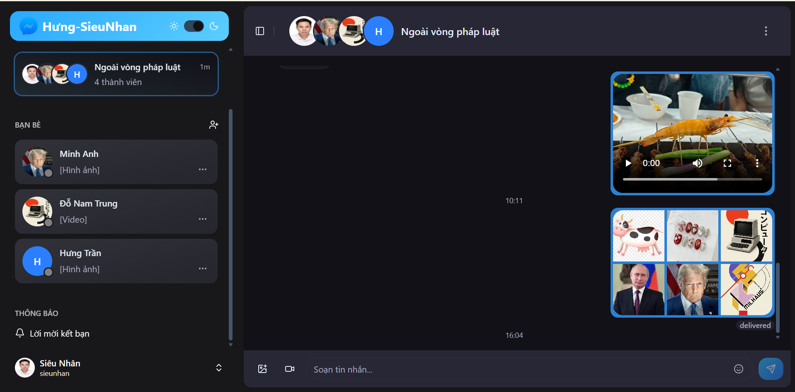
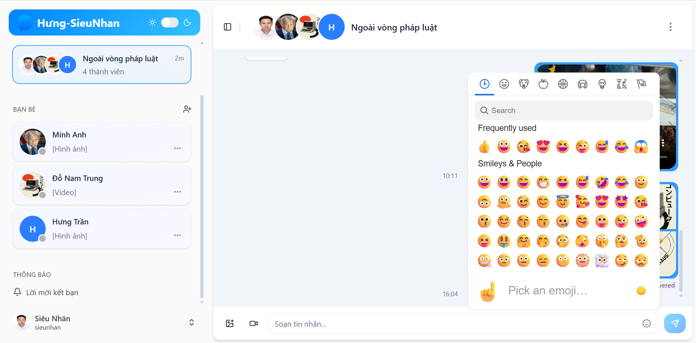
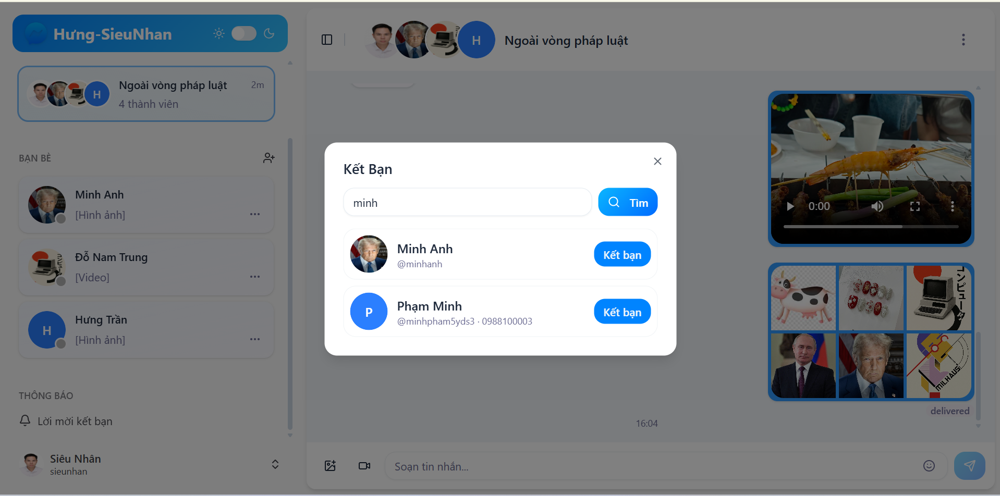
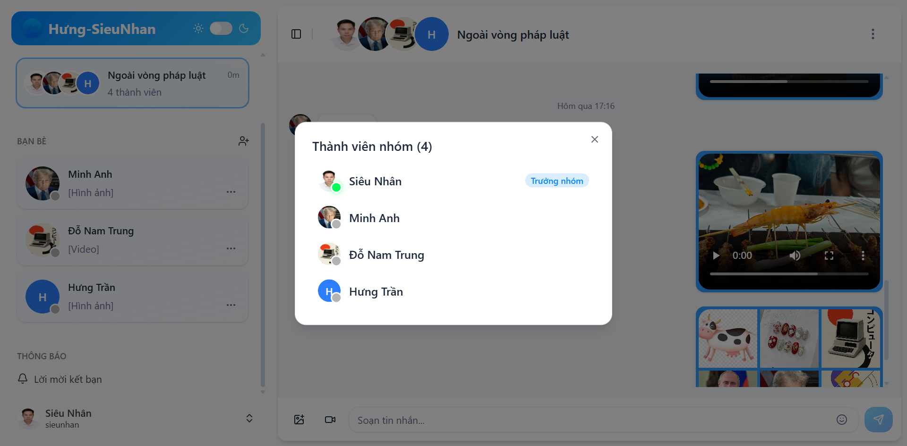
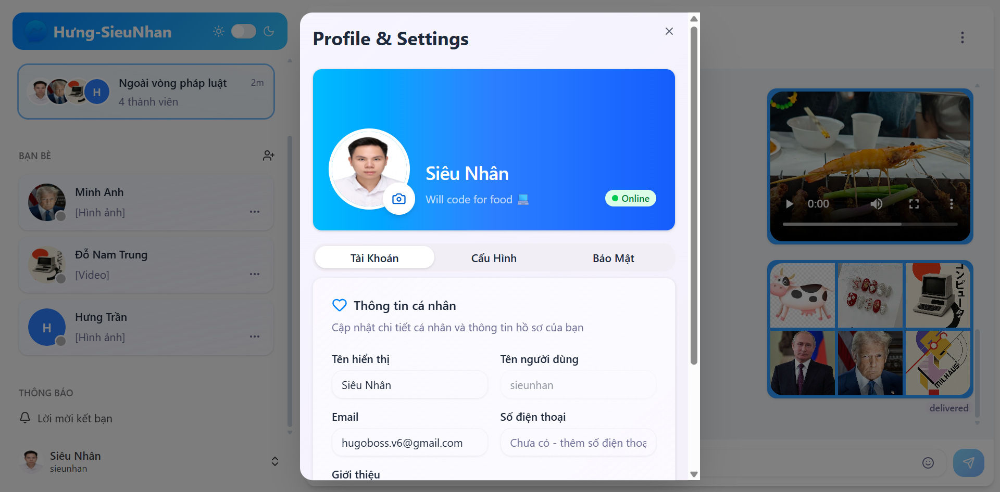
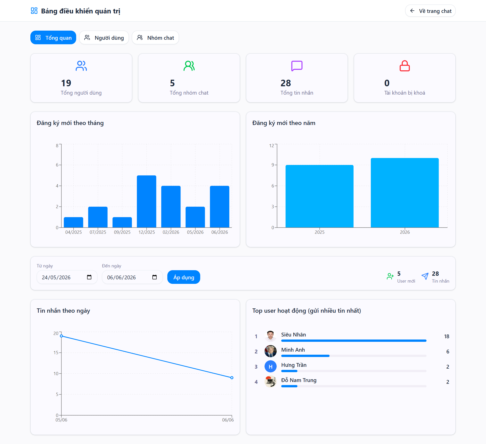
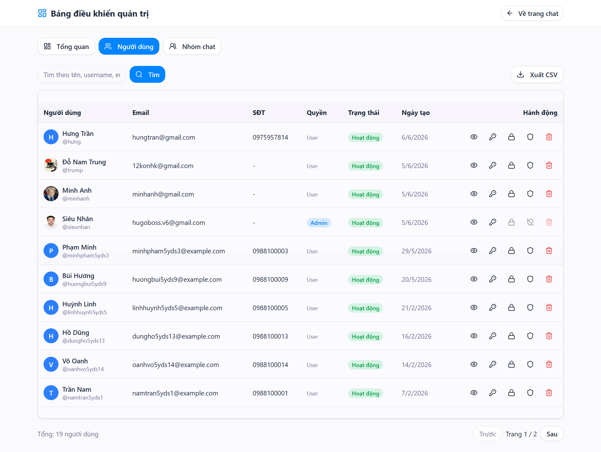
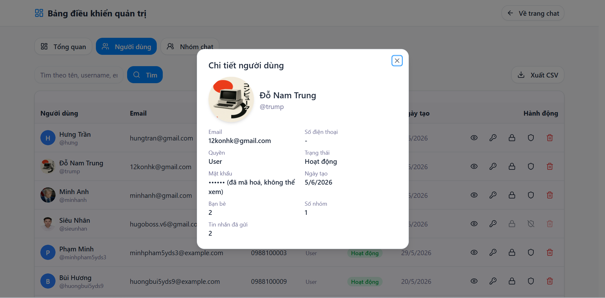
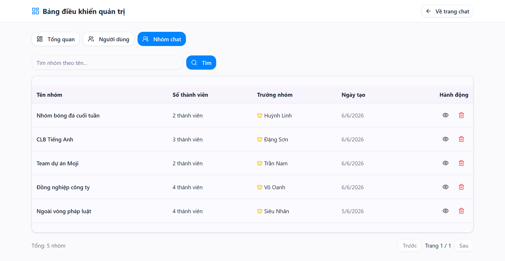
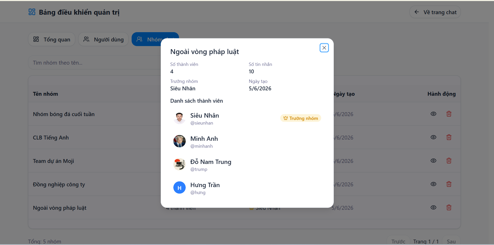

# 💬 AppChat — Ứng dụng Chat Realtime (Hưng-SieuNhan)

Ứng dụng nhắn tin thời gian thực (kiểu Messenger) với đầy đủ tính năng: chat 1-1 & nhóm, gửi ảnh/video, emoji, kết bạn realtime, quên mật khẩu qua email, và **bảng điều khiển quản trị (Admin Dashboard)** với thống kê & biểu đồ.

> Xây dựng với **React + TypeScript** (frontend) và **Node.js + Express + MongoDB + Socket.IO** (backend).

---

## ✨ Tính năng chính

### Nhắn tin & Hội thoại
- 💬 Chat **1-1** và **nhóm** thời gian thực (Socket.IO)
- 🖼️ Gửi **nhiều ảnh** trong 1 tin (lưới kiểu Messenger, tối đa 6 ảnh, tự nén ở client)
- 🎬 Gửi **video** (lưu file trên server)
- 😀 Bảng chọn **emoji**
- ✅ Trạng thái **đã xem / đã gửi**, **online/offline** realtime
- 🔔 Đếm tin chưa đọc

### Bạn bè & Nhóm
- 🔍 Tìm bạn theo **tên hoặc số điện thoại**, gửi lời mời kết bạn realtime
- 👥 Tạo nhóm, **thêm/mời thành viên**, **xem danh sách thành viên** (đánh dấu trưởng nhóm)
- 🚪 **Rời nhóm**, 🗑️ **xoá nhóm** (chỉ trưởng nhóm)
- ❌ Xoá bạn bè

### Tài khoản & Bảo mật
- 🔐 Đăng ký/đăng nhập (đăng nhập bằng **username hoặc SĐT**)
- 📧 **Quên mật khẩu** — gửi mã 4 số qua email (Gmail)
- 🔑 Đổi mật khẩu, cập nhật hồ sơ, đổi avatar
- 🌗 Chế độ **sáng/tối** (dark mode)

### 🛡️ Bảng điều khiển quản trị (Admin)
- 📊 **Thống kê tổng quan**: số user, nhóm, tin nhắn, tài khoản bị khoá
- 📈 **Biểu đồ** đăng ký mới theo tháng/năm, **tin nhắn theo ngày**, **top user hoạt động**
- 🗓️ **Lọc theo khoảng thời gian**
- 👤 **Quản lý người dùng**: tìm kiếm, phân trang, xem chi tiết, đặt lại mật khẩu, khoá/mở, cấp/gỡ quyền admin, xoá, **xuất CSV**
- 👨‍👩‍👧 **Quản lý nhóm**: xem chi tiết thành viên & trưởng nhóm, xoá nhóm

---

## 🛠️ Công nghệ

| Frontend | Backend |
|----------|---------|
| React 19 + TypeScript | Node.js + Express 5 |
| Vite | MongoDB + Mongoose |
| Tailwind CSS + shadcn/ui | Socket.IO |
| Zustand (state) | JWT (auth) + bcrypt |
| React Router | Multer (upload file) |
| Recharts (biểu đồ) | Nodemailer (email) |
| Socket.IO Client | |

---

## 📸 Giao diện

### Nhắn tin (gửi ảnh, video, emoji)
| Chat (dark mode) — ảnh & video | Bảng chọn emoji |
|:---:|:---:|
|  |  |

### Kết bạn & Thành viên nhóm
| Tìm & kết bạn | Xem thành viên nhóm |
|:---:|:---:|
|  |  |

### Hồ sơ cá nhân


### 🛡️ Bảng điều khiển quản trị
**Tổng quan — thống kê & biểu đồ**


**Quản lý người dùng**


| Chi tiết người dùng | Quản lý nhóm |
|:---:|:---:|
|  |  |

**Chi tiết nhóm (thành viên & trưởng nhóm)**


---

## 🚀 Cài đặt & Chạy

> Mã nguồn nằm trong thư mục [`Moji_RealtimeChatApp/`](Moji_RealtimeChatApp).

### Yêu cầu
- Node.js 18+ và MongoDB (hoặc MongoDB Atlas)

### 1. Backend
```bash
cd Moji_RealtimeChatApp/backend
npm install
# tạo file .env (xem backend/.env.example) rồi điền thông tin
npm run dev
```

`backend/.env`:
```env
PORT=5001
MONGODB_CONNECTIONSTRING=<chuỗi kết nối MongoDB của bạn>
ACCESS_TOKEN_SECRET=<chuỗi bí mật ngẫu nhiên>
CLIENT_URL=http://localhost:5174
# (tuỳ chọn) gửi email quên mật khẩu qua Gmail App Password
EMAIL_USER=<email@gmail.com>
EMAIL_PASS=<gmail app password 16 ký tự>
```

### 2. Frontend
```bash
cd Moji_RealtimeChatApp/frontend
npm install
npm run dev
```
Mở http://localhost:5174

> ⚠️ File `backend/.env` chứa thông tin bí mật và **không được commit** lên git (đã có trong `.gitignore`).

---

## 📂 Cấu trúc dự án
```
Moji_RealtimeChatApp/
  backend/        # API Express + Socket.IO + MongoDB
    src/
      controllers/  # auth, user, friend, message, conversation, admin
      models/       # User, Conversation, Message, Friend, ...
      routes/       # các route API
      middlewares/  # auth, admin, upload
      socket/       # cấu hình Socket.IO
  frontend/       # React + Vite + TypeScript
    src/
      components/   # chat, dashboard, profile, sidebar, ui...
      pages/        # SignIn, SignUp, ForgotPassword, Dashboard, ChatApp
      stores/       # zustand stores
      services/     # gọi API
screenshots/      # ảnh giao diện
```
